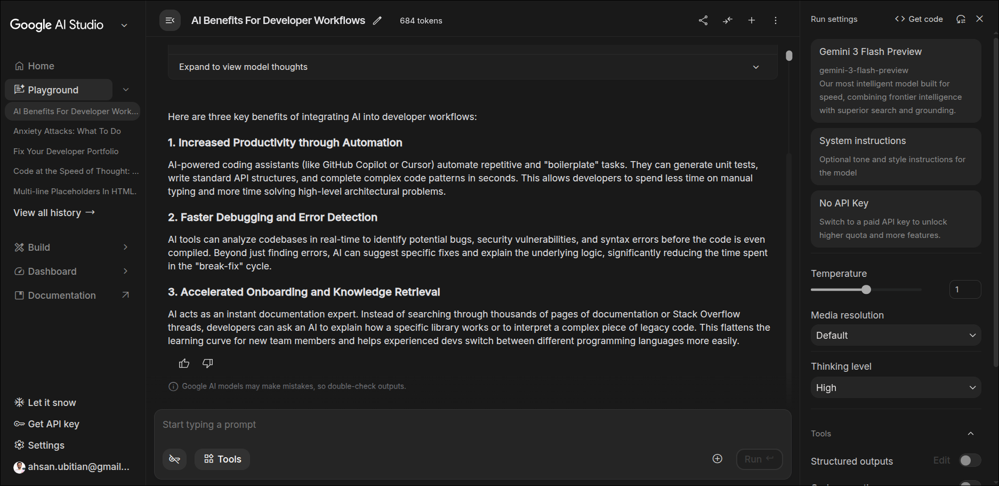
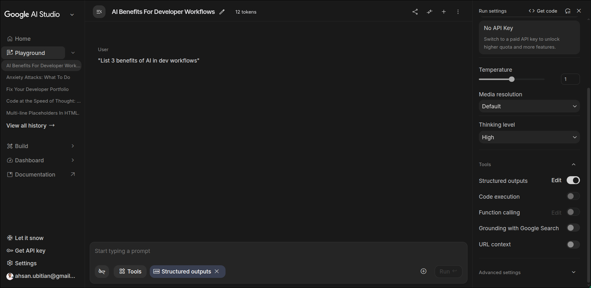
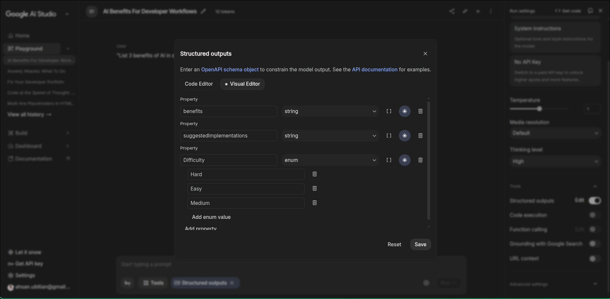

# Module 02: Structured Output Demonstration

**Instructor Guide**
**Duration:** 5-7 minutes
**Format:** Live demonstration in AI Studio

## Introduction (1 minute)

### The Problem

"Let's talk about a common challenge when building real applications with AI models: getting structured, parseable data from text-based responses.

Imagine you're building an API that analyzes customer feedback. Your backend needs a JSON object with specific fields: sentiment, topic, confidence score. The old way was to prompt the model 'please return JSON' and hope it cooperates. But you'd often get:
- Invalid JSON with syntax errors
- Inconsistent field names
- Missing required fields
- Text wrapped around JSON
- 'Almost correct' responses that crash your parser

This works for demos, but not for production."

### The Solution

"Gemini solves this with **native structured output** using JSON Schema. This isn't prompt engineering or hoping – it's schema enforcement at the API level. The model is guaranteed to return valid JSON matching your exact specification.

Let me show you how this works in AI Studio."

## Step-by-Step Demonstration (5-6 minutes)

### 1. Open AI Studio and Create New Prompt

**Action:**
- Navigate to [aistudio.google.com](https://aistudio.google.com)
- Click "New prompt" or "Create new prompt"
- Select "Freeform prompt" if prompted

**Expected result:**
Prompt editor opens with text input area and "Run" button

**Say to participants:**
"This is the standard AI Studio prompt interface. We'll start with a regular prompt to see the default behavior."

---

### 2. Write a Prompt (Without JSON Instructions)

**Action:**
- In the prompt editor, enter:
  ```
  Analyze this product: iPhone 15 Pro
  ```
- **Important:** Do NOT ask for JSON in the prompt
- Click "Run"

**Expected result:**
Text response in paragraph format, something like:
```
The iPhone 15 Pro is Apple's flagship smartphone featuring...
[paragraphs of text]
```

**Point out:**
"Notice this is natural language – great for reading, but how do you parse this? Where does 'product_name' end and 'features' begin? You'd need complex regex or hope the format is consistent. This is the problem."



---

### 3. Enable JSON Mode

**Action:**
- Click "Run settings" (gear icon ⚙️ in top right corner)
- Settings panel slides in from the right

**Expected result:**
Settings panel opens showing:
- Temperature slider
- Response format options
- Other configuration settings

**Action:**
- Under "Response format", select "JSON mode" (or "JSON" depending on interface)

**Expected result:**
Schema editor appears below the selection, showing a JSON schema input area

**Say to participants:**
"This is where the magic happens. JSON mode tells Gemini: don't just try to return JSON – guarantee it. And the schema defines exactly what structure we want."



---

### 4. Load Example Schema

**Action:**
- Open `schema-examples/product-schema.json` in a text editor or file viewer
- Copy the entire contents
- Paste into the schema editor in AI Studio

**Schema content:**
```json
{
  "type": "object",
  "properties": {
    "product_name": {
      "type": "string",
      "description": "The name of the product"
    },
    "category": {
      "type": "string",
      "description": "Product category (electronics, clothing, food, etc.)"
    },
    "price_estimate": {
      "type": "number",
      "description": "Estimated price in USD"
    },
    "features": {
      "type": "array",
      "description": "List of key product features",
      "items": {
        "type": "string"
      }
    },
    "target_audience": {
      "type": "string",
      "description": "Who this product is designed for"
    }
  },
  "required": ["product_name", "category", "price_estimate", "features"]
}
```

**Expected result:**
- Schema validates (green checkmark or no errors)
- If errors appear, double-check JSON syntax (commas, brackets)

**Point out – this is critical:**
"Look closely at the description fields. These aren't just documentation – they're **instructions to the model**. When Gemini sees `'description': 'Product category (electronics, clothing, food, etc.)'`, it understands what kind of value to put there. Without descriptions, the model would guess. With descriptions, it has clear guidance."

---

### 5. Run with Schema Enforcement

**Action:**
- Ensure JSON mode is still enabled and schema is loaded
- Click "Run" (use the same prompt: "Analyze this product: iPhone 15 Pro")

**Expected result:**
Valid JSON response matching the schema structure:
```json
{
  "product_name": "iPhone 15 Pro",
  "category": "electronics",
  "price_estimate": 999,
  "features": [
    "A17 Pro chip",
    "Titanium design",
    "USB-C port",
    "48MP camera system",
    "Action button"
  ],
  "target_audience": "Tech enthusiasts and professionals who want the latest flagship smartphone"
}
```

**Point out – emphasize each of these:**
1. **No "return as JSON" in prompt needed** – We didn't ask for JSON anywhere in the prompt
2. **Schema guarantees structure** – Every required field is present, correct types
3. **Descriptions guided content** – Model used description fields to populate values correctly
4. **Production-ready** – This JSON can be directly parsed, validated, inserted into a database



---

### 6. Show the API Code

**Action:**
- Click "Get code" button (usually top right, near Run)
- Select "Python" from language dropdown

**Expected result:**
Code snippet appears showing the API equivalent:
```python
from google import genai
from google.genai import types

client = genai.Client(api_key="YOUR_API_KEY")

product_schema = {
  # ... schema definition ...
}

config = types.GenerateContentConfig(
    response_mime_type="application/json",
    response_json_schema=product_schema
)

response = client.models.generate_content(
    model="gemini-3-flash-preview",
    contents="Analyze this product: iPhone 15 Pro",
    config=config
)

print(response.text)
```

**Point out:**
"See these two lines? `response_mime_type='application/json'` tells Gemini to return JSON, and `response_json_schema` passes your schema. This is how you'd use structured output in production code. Everything we just did in the UI has an API equivalent."

**Say to participants:**
"You'll get to create your own schema in a moment. But first, let me show you a common mistake..."

---

## Key Talking Points (Weave Throughout Demo)

### Enforcement vs Prompting
"This is schema **enforcement**, not prompt engineering. The model cannot return anything except valid JSON matching this schema. It's not trying its best – it's guaranteed."

### Description Fields Matter
"I can't stress this enough: description fields are instructions to the model, not just documentation. A schema without descriptions will give you valid structure but potentially wrong or generic values."

### Valid Structure ≠ Correct Content
"Important distinction: the schema ensures the JSON is **valid** (correct structure, types, required fields), but it doesn't guarantee the values are **accurate**. If you ask about a product that doesn't exist, you'll get valid JSON with made-up values. Schema is about structure, not truth."

### API Equivalence
"Everything in AI Studio translates directly to API code. If you can configure it in the UI, you can do it programmatically. Use the 'Get code' button whenever you want to see how."

---

## Common Pitfall Demonstration (2 minutes)

### Bad Schema (No Descriptions)

**Action:**
- Modify the schema to remove all description fields
- Example:
  ```json
  {
    "type": "object",
    "properties": {
      "product_name": {"type": "string"},
      "category": {"type": "string"},
      "price_estimate": {"type": "number"}
    },
    "required": ["product_name", "category", "price_estimate"]
  }
  ```
- Run the same prompt again

**Expected result:**
Valid JSON but potentially with:
- Generic/vague values
- Less accurate field population
- Model "guessing" what you want

**Point out:**
"See? Still valid JSON, but the values are less precise because the model doesn't have description guidance. This is a very common mistake: creating schemas without descriptions and wondering why results aren't good."

**Action:**
- Add descriptions back
- Run again
- Show improvement

**Say to participants:**
"Always add descriptions. They're not optional if you want quality results."

---

## Wrap-Up (30 seconds)

"That's structured output with Gemini. You've seen:
- How to enable JSON mode in AI Studio
- How to define a schema with descriptions
- The difference between prompting for JSON vs. schema enforcement
- How this translates to API code

Now it's your turn. In the exercise, you'll create your own schema for analyzing customer feedback. You'll see exactly how powerful description fields are when you iterate on your schema.

Open `exercise.md` and let's get started. You have about 12 minutes."

---

## Instructor Notes

**Timing:**
- Introduction: 1 minute
- Steps 1-6: 4-5 minutes total (about 1 minute each, steps 4-5 can be faster)
- Common pitfall: 1-2 minutes
- Wrap-up: 30 seconds

**Common Questions:**

**Q: "Can I use any JSON Schema features?"**
A: Most standard features work (types, arrays, objects, required, enum), but some advanced features may not be supported. Check the [documentation](https://ai.google.dev/gemini-api/docs/structured-output) for the full list.

**Q: "What if the schema is wrong?"**
A: AI Studio will show a validation error. Fix the JSON syntax (missing commas, brackets, quotes are most common issues).

**Q: "Does this work with images or just text?"**
A: Works with multimodal inputs too! You can combine an image + text prompt with structured output. We'll see this in Module 03.

**Q: "Is there a limit on schema size?"**
A: Schemas are counted toward your token limit, but reasonable schemas (under 1KB) are fine. Very large schemas may impact performance.

**Screenshots Needed:**
1. Text response from unstructured prompt (step 2)
2. Run settings panel with JSON mode and schema editor (step 3)
3. Valid JSON response matching schema (step 5)

**Backup Plan:**
If AI Studio is experiencing issues, show the demonstration using the API code directly in a Python notebook or script. The learning objectives remain the same.
